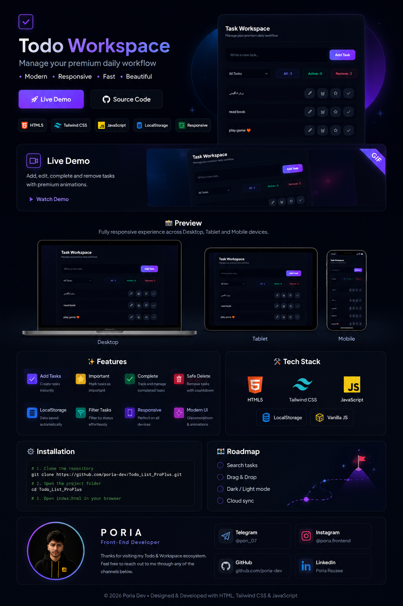

<div align="center">



<br>


# ✨ Premium Todo Workspace

### Modern Productivity • Glassmorphism • Responsive • Vanilla JavaScript

<p>

A premium Todo application crafted with modern UI principles, smooth interactions,
glassmorphism effects, and responsive layouts — built entirely with Vanilla JavaScript.

</p>

<br>

<a href="https://poria-dev.github.io/Todo_List_ProPlus/src">

</a>

<a href="https://github.com/poria-dev/Todo_List_ProPlus">

</a>

</div>

---

<div align="center">


</div>

---

# 🌟 Why This Project?

Unlike traditional Todo applications, **Premium Todo Workspace** focuses on creating a polished user experience with elegant animations, premium glassmorphism effects, responsive layouts, and clean architecture.---

# 📑 Table of Contents

- [🎥 Live Demo](#-live-demo)
- [📸 Responsive Preview](#-responsive-preview)
- [✨ Features](#-features)
- [🛠 Tech Stack](#-tech-stack)
- [📂 Project Structure](#-project-structure)
- [⚙ Installation](#-installation)
- [🚀 Usage](#-usage)
- [📊 Dashboard Features](#-dashboard-features)
- [🎨 UI Highlights](#-ui-highlights)
- [📱 Responsive Design](#-responsive-design)
- [⚡ Performance](#-performance)
- [🧠 What I Learned](#-what-i-learned)
- [🛣 Roadmap](#-roadmap)
- [👨‍💻 Developer](#-developer)

---

# 🎥 Live Demo

<div align="center">

### 🚀 Experience the application live

<a href="https://poria-dev.github.io/Todo_List_ProPlus/src">


</a>

<br><br>

### 🔗 https://poria-dev.github.io/Todo_List_ProPlus/src

</div>


---

# 🎬 Application Walkthrough

<div align="center">


</div>

---

# 💎 Project Overview

Premium Todo Workspace is a modern productivity application built with pure HTML, Tailwind CSS, and Vanilla JavaScript.

The project emphasizes elegant UI, smooth interactions, responsive layouts, and real-time task management without relying on external frameworks.

Its primary goal is to demonstrate clean frontend architecture, DOM manipulation, state persistence using LocalStorage, and polished user experience suitable for a professional portfolio.

---

# ✨ Highlights

<div align="center">

| 🚀 Fast | 💾 Persistent | 📱 Responsive | 🎨 Modern UI |
|:-------:|:-------------:|:-------------:|:------------:|
| Vanilla JS | LocalStorage | Mobile First | Glassmorphism |

| ⚡ Smooth | 🌙 Dark Mode | ⭐ Interactive | 📊 Live Stats |
|:---------:|:------------:|:-------------:|:------------:|
| Animations | Premium Theme | Rich UX | Real-time |

</div>

---

# ✨ Features

<div align="center">

| 📝 Task Management | 🎨 User Interface | ⚡ Smart Functionality |
|:------------------:|:----------------:|:----------------------:|
| ➕ Add Tasks | ✨ Glassmorphism Design | 💾 LocalStorage |
| ✏️ Edit Tasks | 🌙 Premium Dark Theme | 📊 Live Statistics |
| ⭐ Pin Important Tasks | 🎉 Animated Toasts | 🔄 Auto Save |
| ✔ Mark as Completed | 🌈 Gradient Effects | ⚡ Instant Rendering |
| 🗑 Safe Delete | 🪄 Smooth Hover Effects | 🔍 Live Filtering |
| ⏳ Delete Countdown | 📱 Fully Responsive | 🎯 Dynamic DOM Updates |
| ❌ Cancel Delete | 💎 Modern Dashboard | 🚀 Lightweight |
| 📌 Organized Workflow | 🎨 Elegant Typography | 🔥 Optimized Performance |

</div>

---

# 🛠 Tech Stack

<div align="center">

| Technology | Description |
|------------|-------------|
| 🌐 HTML5 | Semantic page structure |
| 🎨 Tailwind CSS | Utility-first styling |
| ⚡ Vanilla JavaScript | Application logic |
| 💾 LocalStorage API | Persistent data storage |
| 🎭 CSS Animations | Smooth transitions |
| 📱 Responsive Design | Mobile-first layout |

</div>

---

# 📂 Project Structure

```text
Todo_List_ProPlus
│
├── img
│   └── banner.png
│
├── src
│   ├── img
│   │   ├── lab.png
│   │   ├── tab.png
│   │   └── phone.png
│   │
│   ├── app.js
│   ├── index.html
│   ├── output.css
│   └── input.css
│
├── demo.gif
├── README.md
└── LICENSE
```

---

# ⚙ Installation

Clone the repository

```bash
git clone https://github.com/poria-dev/Todo_List_ProPlus.git
```

Move into the project directory

```bash
cd Todo_List_ProPlus
```

Open the project

```bash
Open src/index.html
```

or use VS Code Live Server

```bash
Right Click → Open with Live Server
```

---

# 🚀 Usage

### Create Tasks

Add unlimited tasks with a clean and intuitive interface.

---

### Edit Tasks

Modify task names at any time without losing data.

---

### Complete Tasks

Mark tasks as completed with beautiful visual feedback.

---

### Important Tasks

Pin important tasks to the top of the workspace.

---

### Safe Delete

Deleting a task starts a countdown instead of removing it immediately, allowing users to cancel the action before it is permanently deleted.

---

### Automatic Saving

Every change is instantly synchronized with LocalStorage, ensuring that your data remains available after refreshing or reopening the browser.

---

# 📊 Dashboard Features

✔ Live Total Tasks Counter

✔ Completed Tasks Counter

✔ Removed Tasks Counter

✔ Real-time UI Updates

✔ Automatic Rendering

✔ Responsive Components

✔ Instant Filtering

✔ Persistent Data

---

# 🎨 UI Highlights

✨ Premium Glassmorphism

🌙 Dark User Interface

🎨 Gradient Backgrounds

💎 Soft Shadows

🪄 Smooth Hover Animations

⚡ Fast Transitions

📱 Responsive Components

🎉 Animated Notifications

🖥 Modern Dashboard Layout

🎯 User-Friendly Experience

---

# ⚡ Performance

Premium Todo Workspace is designed to be lightweight and fast.

<div align="center">

| 🚀 Feature | ✅ Status |
|:----------:|:--------:|
| Fast Rendering | ✔ |
| Lightweight | ✔ |
| Framework Free | ✔ |
| Responsive | ✔ |
| LocalStorage | ✔ |
| Dynamic DOM Updates | ✔ |
| Mobile Optimized | ✔ |
| Smooth Animations | ✔ |

</div>

---

# 📱 Responsive Design

The application is fully optimized for every device.

<div align="center">

| 💻 Desktop | 📱 Mobile | 📟 Tablet | 🖥 Large Screen |
|:----------:|:---------:|:---------:|:--------------:|
| ✅ | ✅ | ✅ | ✅ |

</div>

---

# 🧠 What I Learned

Building this project helped me improve my understanding of modern frontend development and user interface design.

### Core Skills

- DOM Manipulation
- Event Handling
- State Management
- LocalStorage API
- Responsive Design
- UI / UX Principles
- Tailwind CSS
- JavaScript ES6+
- Dynamic Rendering
- Component Thinking
- Performance Optimization
- Clean Code Organization

---

# 🛣 Roadmap

The following features are planned for future releases.

- 🔍 Search Tasks
- 🏷 Categories
- 📅 Due Dates
- 🎯 Task Priority
- 🌙 Dark / Light Theme Toggle
- 🖱 Drag & Drop Sorting
- ☁ Cloud Synchronization
- 👤 Authentication
- 📊 Analytics Dashboard
- 📂 Multiple Workspaces
- 📎 Attachments
- 🔔 Notifications

---

# 🤝 Contributing

Contributions, issues and feature requests are always welcome.

If you have ideas for improving this project, feel free to fork the repository and submit a Pull Request.

---

# ⭐ Support

If you enjoyed this project and found it useful, consider giving it a ⭐ on GitHub.

It helps the project grow and motivates future improvements.

<div align="center">

<a href="https://github.com/poria-dev/Todo_List_ProPlus">

</a>

</div>

---

# 📄 License

This project is licensed under the MIT License.

Feel free to use, modify and distribute it.

---

# 👨‍💻 Developer

<div align="center">

# Pooria Rezaee

### Frontend Developer

Building modern, interactive and user-focused web experiences with clean code and beautiful interfaces.

<br>

<a href="https://github.com/poria-dev">

</a>

<a href="https://www.linkedin.com/in/pooria-rezaee">

</a>

<a href="mailto:pooriarezaee.dev@gmail.com">

</a>

<br><br>

**Email**

pooriarezaee.dev@gmail.com

</div>

---

<div align="center">

### 🚀 Premium Todo Workspace

Designed & Developed with ❤️ by **Pooria Rezaee**

<br>


</div>
## 📈 GitHub Stats

<div align="center">


</div>
<div align="center">


⭐ **Thanks for visiting this repository!**

</div>


Designed to showcase modern frontend development skills while keeping the codebase lightweight and framework-free.

